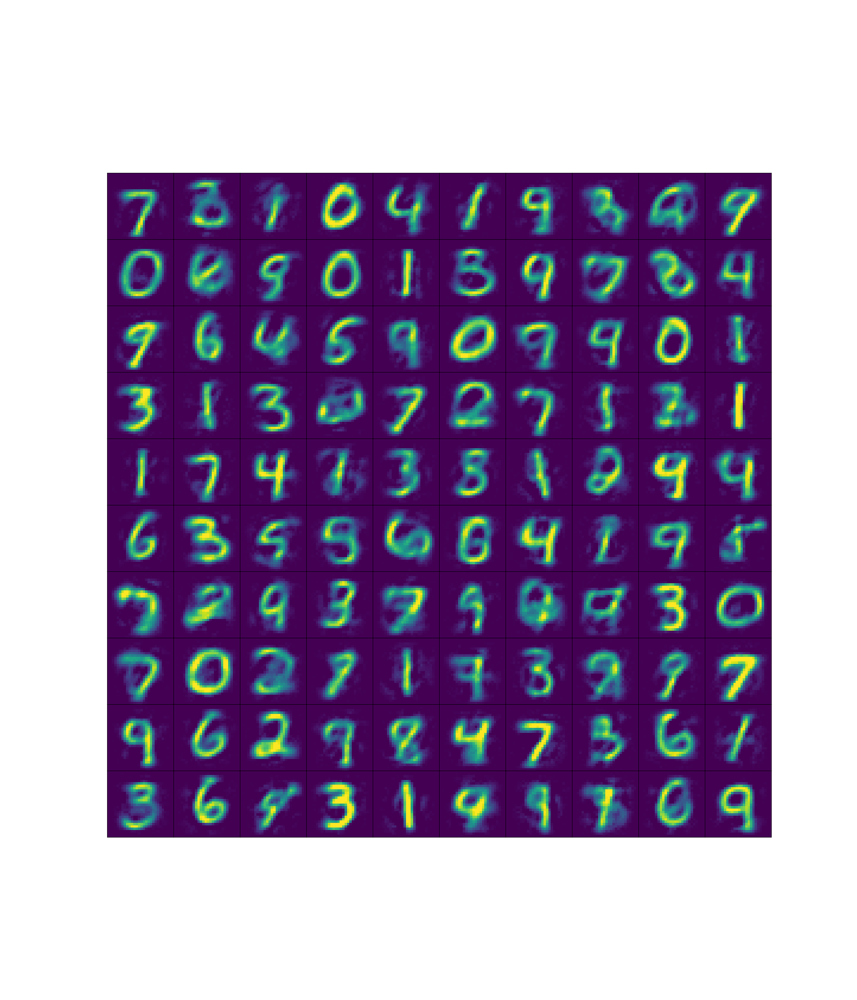
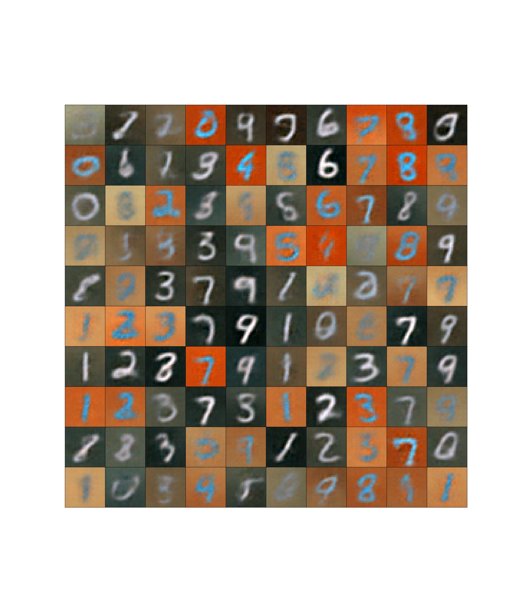

# Further instructions for the final project
Read carfully the 3 files in this folder: `losses.py`, `neural_networks.py` and `utils.py`. 

* `losses.py` provides the formulas to calculate the Kullback-Leibler divergence and the log density of a multivariate Gaussian distribution with diagonal covariance matrix. All input parameters in the functions are simply the outputs of the encoder and decoder networks, and `x` is simply the mini-batch of data used during training. 

* `neural_networks.py` provides the architectures for encoders and decoders using `Dense` layers (MLPs) for black-white images and `Conv2` layers (convolutional neural networks) for color images, as well as values for all hyperparemters. You are free to play around with the hyperparemter values, but the ones in the file work fine.

* `utils.py` provides the way you can define the Adam optimizer for a given learning rate (and default values of other parameters), the function that you need to update the trainable variables in the encoder and decoder of your VAE. Remember that your encoder/decoder classes must inherit from `layers.Layer` and your VAE from `tf.keras.Model`. You also find a nice function to plot a grid of 100 images of the images that you generate, and the links to download all datasets. The test data set is needed to generate the images after you have trained the model. The labels are only needed if you want to assign colors to the scatter plot of the latent space. The safest way to download the data is with `wget` that can be used from Python.

If you succeed with this project, you should see images as the ones below (models are trained for 50 epochs):

